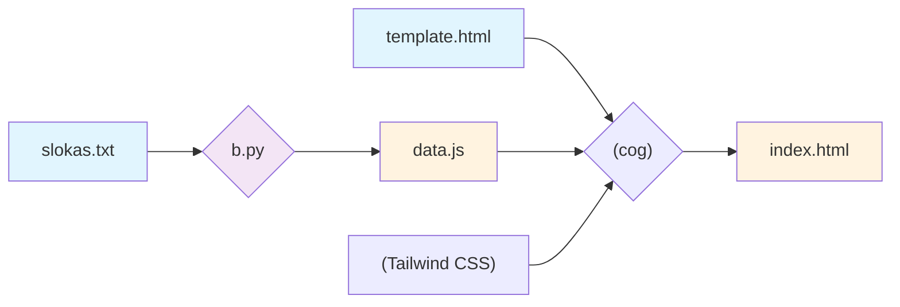

Source code for the webpage serving at [vishnu-sahasranama.shreevatsa.net](https://vishnu-sahasranama.shreevatsa.net/)

This is basically just the data from https://www.swami-krishnananda.org/vishnu/vishnu_1.html etc (which was on the first page of search results), coloured such that consecutive names are in different colours.

## Data/code structure

The data is in `slokas.txt`, and the rest of the files transform it into `index.html`.

Specifically (see `Makefile`):

- The Python script turns `slokas.txt` into `data.js`.
- The file `template.html` is the skeleton, referring to dependencies (the entirety of Tailwind (sorry!) for CSS, and `data.js` for the data) using [`cog`](https://cog.readthedocs.io/en/latest/).
- The generated `index.html` (a single file with all dependencies inlined into it) is served on the website.

## AI usage statement

The file `slokas.txt` was manually generated:

- Manually copied the data from [Swami Krishnananda's website](https://www.swami-krishnananda.org/vishnu/vishnu_1.html) into `slokas.txt` via a Markdown editor (Obsidian).
- Opened Emacs and ran the elisp in `manual-process/emacs-setup.el`.
- Opened `slokas.txt` and manually went over it, using the `=` character set up in Emacs above. See video file `editing-sample.mov` for a video recording.

Everything else had some AI assistance: the Python script (`slokas_parse.py`), the HTML template (`template.html`) and even the supporting Elisp (`emacs-setup.el`).
